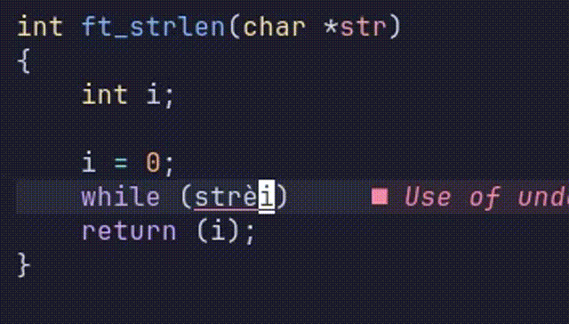
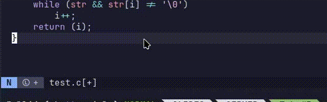

---

marp: false
theme: default
paginate: false

---

<!--
backgroundImage: url('img/vim.png')
backgroundSize: 700px
backgroundPosition: calc(100% - 20px) center
backgroundRepeat: no-repeat
-->

# Introduzione a Vim

a cura di **rceschel**

---

<!-- backgroundImage: color(white)-->

## Obiettivi di oggi

- Comprendere il paradigma di **editor modale**
- Muoversi con naturalezza in un file
- Imparare a **personalizzare l'ambiente** di Vim
- Scoprire come approfondire e allenarsi in autonomia

---

## Perché Vim

- È leggero, veloce, sempre presente
- È integrato nel **terminale**, il nostro ambiente
- All'inizio è scarno, ma può essere riempito

Vim appare vuoto e dispersivo, ma per questo potrà conformarsi ad ogni nostra esigenza.

---

### Esempio di configurazione avanzata


---

## Vim è un editor modale

Il flusso di lavoro cambia a seconda della modalità in cui ti trovi:

<!-- | Normal                                      | Visual                                  | Insert              | -->
<!-- | ------------------------------------------- | --------------------------------------- | ------------------- | -->
<!-- | Eseguo operazioni rapide e mirate sul testo | Effettuo selezioni e modifiche di ampie | Inserisco del testo | -->

<table>
<br>
  <tr>
    <th>Normal</th>
    <td>Il punto di partenza per lavorare nel file</td>
  </tr>
  <tr>
    <th>Visual</th>
    <td>Effettuo selezioni e modifiche ampie</td>
  </tr>
  <tr>
    <th>Insert</th>
    <td>Inserisco effettivamente del testo</td>
  </tr>
</table>

Queste sono le modalità più comuni.

---

## Editor modale

### Idee fondamentali

- **Digitare ≠ Scrivere**
- Scrivere è solo *una modalità*
- Di default sono in **Normal**

Visualizza Vim come un **sistema a stati**.

Complesse operazioni sul testo vengono eseguite con combinazioni **sequenziali** di tasti, secondo una logica sintattica, non solo mnemonica.

Questo si traduce in **comodità** ed **efficienza**.

---

<!--
backgroundImage: url('img/WRITE!.png')
backgroundSize: 720px
backgroundPosition: calc(100% - 20px) center
backgroundRepeat: no-repeat
-->

# Insert mode



---

<!-- backgroundImage: color(white)-->

Ci sono vari modi di entare in insert mode.

| Comando | Dove scriverai    |
| ------- | ----------------- |
| `i`     | prima del cursore |
| `I`     | inizio riga       |
| `a`     | dopo il cursore   |
| `A`     | fine riga         |
| `o`     | nuova riga sotto  |
| `O`     | nuova riga sopra  |

Uscire sempre con **ESC**.

---
<!--
backgroundImage: url('img/normal.jpeg')
backgroundSize: 800px
backgroundPosition: calc(100% - 20px) center
backgroundRepeat: no-repeat
-->

# Normal Mode
## Una casa per tutti

---

<!-- backgroundImage: color(white)-->

Nella **Normal Mode** posso muovermi nel file e modificare il testo.

Posso anche dare **comandi** al mio editor, come annullare l'ultima
modifica o eliminare una riga.

Dalla Normal Mode posso raggiungere tutte le altre modalità.

---

## Muoversi nel file

**Motions** fondamentali:

`h` `j` `k` `l` → sinistra, giù, su, destra
`w` → `word` - parola successiva
`e` → `end` - fine parola
`0` → inizio riga
`$` → fine riga

---

<!-- ## Muoversi nel file

Movimenti globali:

- `G` → fine del file
- `gg` → inizio del file

---

## Muoversi nel file

Movimenti mirati:

- `:` → entra in command line, digita il numero di riga per muoverti
- `/` → Search: digita un termine per trovarlo nel file
    - `n` → occorrenza successiva
    - `N` → occorrenza precedente

--- -->

<!-- backgroundImage: color(white)-->

## Lavorare nel file

**Operators** fondamentali:

`d` → delete (cancella / taglia)
`y` → yank (copia)
`p` → put (incolla)


Gli operatori **da soli non fanno nulla**.
Serve un obiettivo.

---

## Vim è un linguaggio

La formula magica:

`OPERATOR` + `COUNT` + `MOTION`

Traduce in comandi il nostro linguaggio naturale.

- "Delete Word"
- "Yank to the end of line"
- "Move three times down"
 
---

## Il modello combinatorio

| Comando | Significato           |
| ------- | --------------------- |
| `dw`    | delete word           |
| `d2w`   | delete 2 words        |
| `d$`    | delete to end of line |
| `dd`    | delete line           |
| `3dd`   | 3 times delete line   |


Stesso *operator*, diverse *motion*.
**Nota**: un operatore ripetuto due volte si applica a tutta la linea.

---

<!--
backgroundImage: url('img/visual.gif')
backgroundSize: 720px
backgroundPosition: calc(100% - 20px) center
backgroundRepeat: no-repeat
-->

# Visual mode
## Visualizza e poi agisci

---

<!-- backgroundImage: color(white)-->

<!-- ### Selezionare prima di agire -->

<!-- |           |                               | -->
<!-- | --------- | ----------------------------- | -->
<!-- | V         | entri in visual mode          | -->
<!-- | Motions   | muovendo il cursore selezioni | -->
<!-- | Operators | si applicano sulla selezione  | -->

## Flusso della visual mode

- Entro in visual mode con **v**
- Eseguo le **motions**, selezionando
- Applico gli **operators** sulla selezione


È familiare, ma più macchinoso del modello base.
Usala per eseguire azioni su zone ampie di codice.

---

<!--
backgroundImage: url('img/red_button_esc.png')
backgroundSize: 670px
backgroundPosition: right
backgroundRepeat: no-repeat
-->


## Il panic button

Se non sai cosa sta succedendo:

## **ESC**

- Torni sempre in Normal mode
- Puoi premerlo più volte

Premilo senza paura, o quando ne hai.

---

<!-- backgroundImage: color(white)-->

## **Sbagliare è permesso**

| Comando  | Effetto                                        |
| -------- | ---------------------------------------------- |
| `u`      | annulla l'ultima modifica                      |
| `U`      | annulla tutte le modifiche sulla riga corrente |
| `CTRL-R` | ripristina le modifiche annullate              |
| `.`      | ripete ultima modifica                         |

Riduce errori e fatica.

*Questi comandi sono validi per la normal mode*

---

<!--
backgroundImage: url('img/search.gif')
backgroundSize: 700px
backgroundPosition: calc(100% - 25px) center
backgroundRepeat: no-repeat
-->

## **Cercare nel file**

`/` → entro in **Search Mode**

Digito i termini di ricerca

`n` → **prossimo** match
`N` → match **precedente**

---

<!-- backgroundImage: color(white)-->
## Cosa avete visto

- Vim è **modale**
- Normal mode è centrale
- Operatore + movimento
- Undo, ricerca, ripetizione

Questo è **il core di Vim**.

---

<!--
backgroundImage: url('img/hackerman.png')
backgroundSize: 700px
backgroundPosition: calc(100% - 50px) center
backgroundRepeat: no-repeat
-->

# Command line
## I've got the power

---

<!-- backgroundImage: color(white)-->
<!-- ## Comandi base -->
Nella command line possiamo dare 
**comandi e istruzioni** direttamente a Vim.

| Comando |    Azione    |
| :-----: | :----------: |
|  `:w`   |    write     |
|  `:q`   |     quit     |
|  `:x`   | write + quit |

È utile per cambiare impostazioni al volo,
e per eseguire operazioni avanzate.

---

## Ecco alcuni comandi utili

| Comando        | Azione                                     |
| -------------- | ------------------------------------------ |
| `:42`          | vai alla riga 42                           |
| `:Stdheader`   | scrivi l'header 42                         |
| `:set number`  | aggiunge i numeri di riga all'interfaccia  |
| `:open <file>` | apre un file dentro vim                    |
| `:! <cmd>`     | esegue <cmd> nella shell e mostra l'output |

---

## Chiedi consiglio!

Se non ricordi un comando, prova con **TAB** o **<CRTL-D>**

<!--  -->


---

## E adesso?

Per praticare:

- `vimtutor` - Programma di guida introduttiva comprensiva ed estesa a Vim
- `:help` - Menù di aiuto completo su tutto Vim

La velocità arriva **solo con la pratica**.

---

<!--
backgroundImage: url('img/cat_blanket_meme_vim.png')
backgroundSize: 670px
backgroundPosition: right
backgroundRepeat: no-repeat
-->

# Personalizzazione
## Creare il proprio ambiente

---

PARLARE DI .vimrc E COME VIENE LETTO

---
<!-- backgroundImage: color(white) -->
<!--
backgroundImage: url('img/chefs-kiss-french-chef.gif')
backgroundSize: 1400px
backgroundPosition: top right
backgroundRepeat: no-repeat
-->

**La selezione dello chef**

``` vim
" Righe e numeri di riga
set number 				" Abilita i numeri di riga
set relativenumber 	    " Imposta i numeri relativi (a partire dal cursore)

" Indentazione e tab
set tabstop=4			" Numero di spazi visualizzati quando Vim incontra un carattere <Tab>
set softabstop=4		" Numero di spazi inseriti o rimossi premendo <Tab> o <Backspace> in modalità inserimento
set shiftwidth=4		" Numero di spazi usati per ogni livello di indentazione (>>, <<, autoindent)

set autoindent 			" Indentazione automatica attiva
set cindent				" Imposta lo stile C-like di indentazione

" Utilizzo generale
set mouse=a 			" Abilita l'uso del mouse in tutte le modalità
syntax on 				" Abilita l'evidenziazione della sintassi
```
